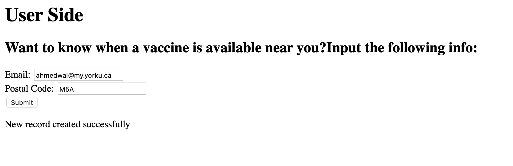
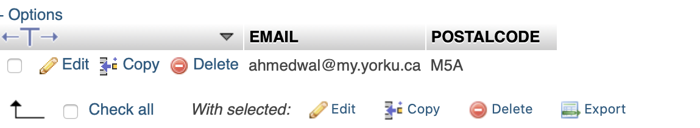
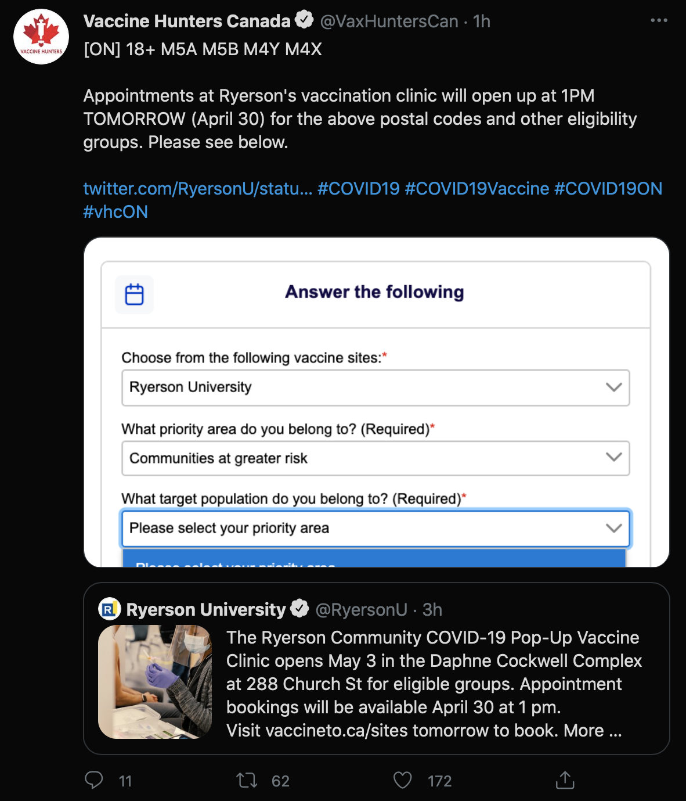
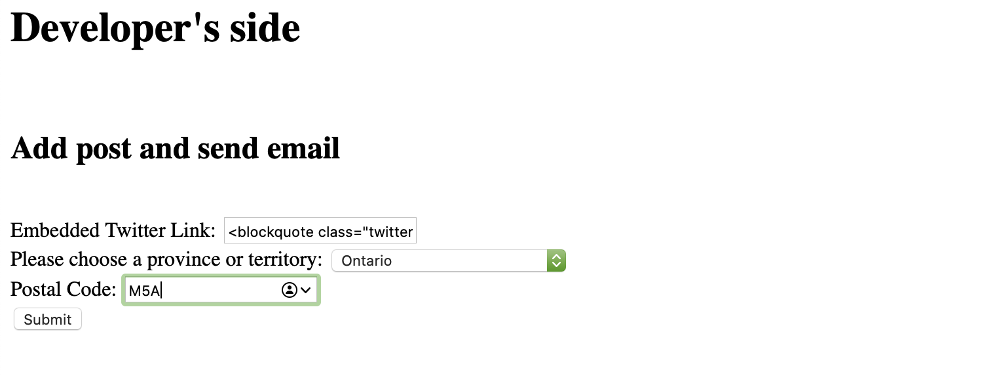
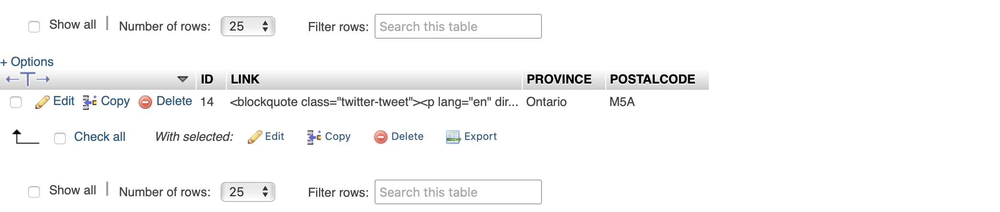
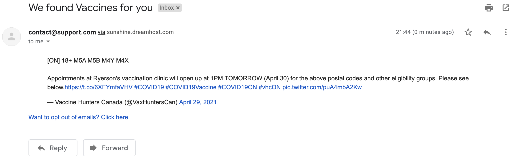
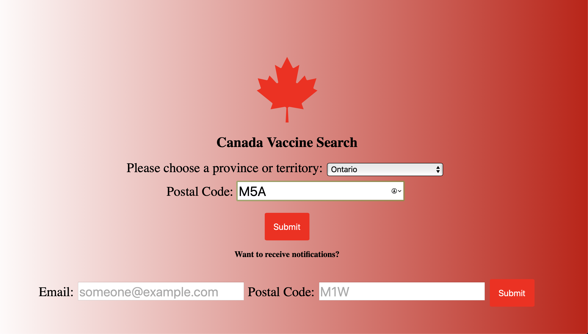
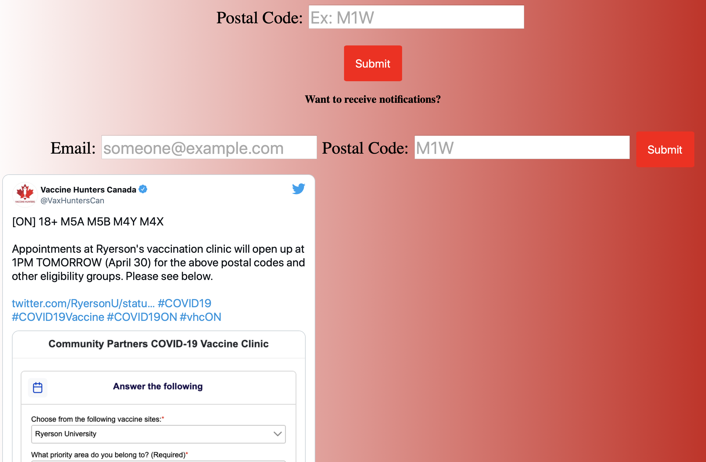

# CANVAXHUNTING
Notification System for Canadian vaccines using postal code as input. Moreover, allowing users to find relevant vaccine posts that pertain to their own postal code.

##Website

Website can be found here:
http://canvaxsearch.dreamhosters.com
## Front End

No front end design was developed.
## Database (SQL)

These are the two required database tables for the notification system.

```
CREATE TABLE EMAILS (
    EMAIL varchar(255) NOT NULL,
    POSTALCODE varchar(3) NOT NULL,
    PRIMARY KEY (EMAIL)
);
```
```
CREATE TABLE POSTS (
    ID INTEGER NOT NULL AUTO_INCREMENT,
    LINK TEXT NOT NULL,
    PROVINCE varchar(255) NOT NULL,
    POSTALCODE varchar(3) NOT NULL,
    PRIMARY KEY (ID)
);
```


## Usage

From a Developer perspective, they can upload a post to the posts table while notifying people with the same address about that post:


First, lets allow for a user to input their postal code and email:



Thus, an email will be added to the emails table


From a developer's perspective, we'll take this post as an example:



The developer could then upload the post with an embedded link and info through the following:



Once completed, the following will happen:

The posts table will add the given information


An email will be sent to the user:



Another functionality that could happen is the user searching for relevant posts using the following:






## Contributing
Any contribution is welcome

