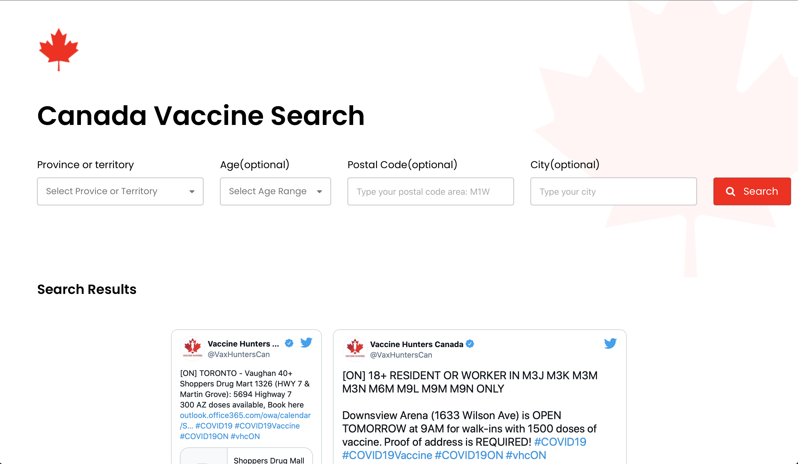

# CANVAXHUNTING
Notification System for Canadian vaccines using postal code as input. Moreover, allowing users to find relevant vaccine posts that pertain to their own postal code.

##Website

Website can be found here:
http://canvaxsearch.com


## Database (SQL)

These are the three essential database tables for the notification system.

```
CREATE TABLE EMAILS (
    EMAIL varchar(255) NOT NULL,
    POSTALCODE varchar(3) NOT NULL,
    PRIMARY KEY (EMAIL)
);
```
```
CREATE TABLE POSTS (
    POST_ID INTEGER NOT NULL AUTO_INCREMENT,
    LINK TEXT NOT NULL,
    EMBEDDED_LINK TEXT NOT NULL,
    DATE DATETIME NOT NULL DEFAULT CURRENT_TIMESTAMP, 
    PRIMARY KEY (POST_ID)
);

CREATE TABLE POSTINFO (
    ID INTEGER NOT NULL,
    PROVINCE varchar(255),
    AGE INT,
    CITY varchar(255),
    POSTALCODE varchar(3),
    FOREIGN KEY (ID) REFERENCES POSTS(POST_ID)
);
```

## Website




