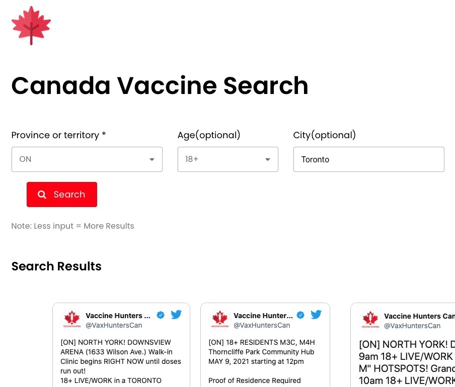
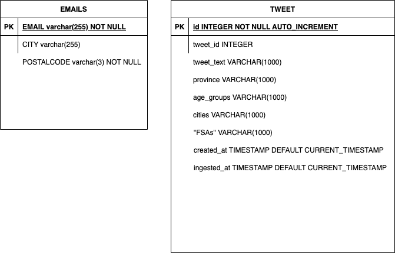

#  CANVAXHUNTING

Notification System for Canadian COVID vaccine availability. This project allowed those who were unable to obtain vaccines to search for availability based on their province, city, and age group filters.

Moreover, opting in to retrieve emails allowed COVID vaccine seekers to retrieve news ASAP about vaccine availability.

  

##  Website

Website can be found here:

http://canvaxsearch.com

## Where we retrieved our data?

  The data that was provided was retrieved from the great samaritans at  [VaxHuntersCan](https://twitter.com/VaxHuntersCan) then filtered and stored in a local database.

## UML diagram

You can visually see our UML diagram here on what a tweet displayed will carry as attributes .

